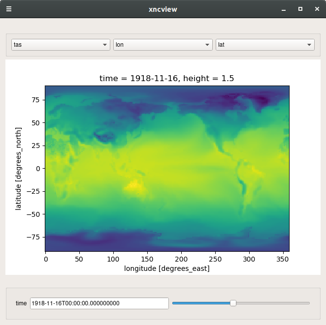

xncview
=======

.. image:: https://travis-ci.com/ScottWales/xncview.svg?branch=master
    :target: https://travis-ci.com/ScottWales/xncview

An implementation of `ncview <http://meteora.ucsd.edu/%7Epierce/ncview_home_page.html>`_ using Python+Xarray

Can be accessed on the command line::

    xncview test.py

Or set up an Xarray Dataset in Python::

    import xarray
    from xncview import xncview

    ds = xarray.Dataset(...)
    xncview(ds)
